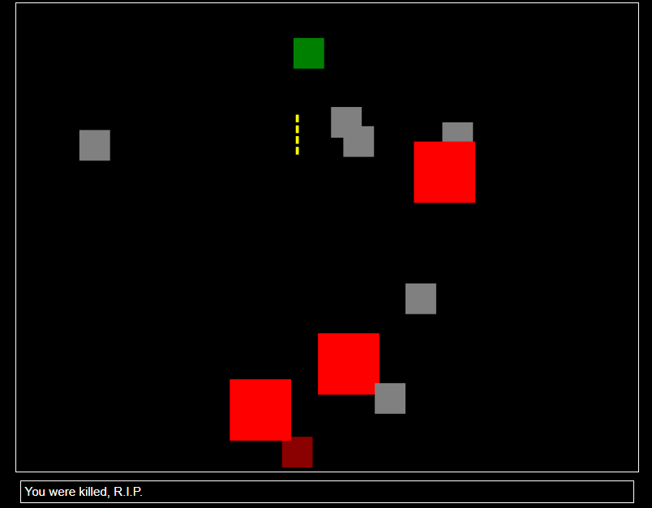

[](https://github.com/sarumaj/edu-space-invaders/actions/workflows/deploy.yml)
[](https://goreportcard.com/report/github.com/sarumaj/edu-space-invaders)
[](https://codeclimate.com/github/sarumaj/edu-space-invaders/maintainability)
[](https://pkg.go.dev/github.com/sarumaj/edu-space-invaders)
[](https://go.dev)

---

# space-invaders

this is an example project to showcase the game development using the Web Assembly Framework in Go.
Web Assembly allows us to develop web-frontend applications in a runtime like Go.

[](assets/gameplay.mp4)

The app is available under [https://edu-space-invaders.herokuapp.com](https://edu-space-invaders-bd0bf5ebb055.herokuapp.com/).

## Setup

To setup similar project follow following steps:

1. Create GitHub repository.
2. [Install](https://github.com/git-guides/install-git) git CLI and [authenticate](https://docs.github.com/en/authentication/keeping-your-account-and-data-secure/about-authentication-to-github) it.
3. Clone your repository:
   ```
   git clone https://github.com/[username]/[repository name]
   cd [repository name]
   ```
4. Initialize new Go module: `go mod init github.com/[username]/[repository name]`, where `github.com/[username]/[repository name]` will be your module name.
5. Start coding. Additional libraries can ben added using `go get [module name]`. Use `go mod tidy` if necessary.
6. Define unit tests and execute: `go test -v ./...`
7. Generate Assembly files and goodies for the distribution package: `go generate ./...`
8. Execute: `go run [program entrypoint file]`
9. Build: `go build [program entrypoint file]`
10. Utilize version control:
11. Status check: `git status`
12. Pull: `git pull`
13. Stage and commit:
    ```
    git add .
    git commit -m "[your commit message goes here]"
    ```
14. Push: `git push`
15. Advanced usage:
    1. Create a temporary branch: `git checkout -b [branch name]`
    2. Pull, stage, commit
    3. Push: `git push --set-upstream origin [branch name]`
    4. Create pull request and merge it through the web interface ([github.com](github.com))

## Application structure

- [directory cmd](cmd)
  - [directory](cmd/space-invaders)
    - [game server main.go](cmd/space-invaders/main.go)
    - [service config file boot.yaml](cmd/space-invaders/boot.yaml)
- [module file go.mod](go.mod)
- [source directory](src)
  - [package pkg](src/pkg)
    - [package config](src/pkg/config)
      - [code file const.go](src/pkg/config/const.go)
      - [code file js.go](src/pkg/config/js.go)
      - [code file os.go](src/pkg/config/os.go)
    - [package handler](src/pkg/handler)
      - [code file handler.go](src/pkg/handler/handler.go)
      - [code file handlerjs.go](src/pkg/handler/handlerjs.go)
      - [code file handleros.go](src/pkg/handler/handleros.go)
    - [package objects](src/pkg/objects)
      - [package bullet](src/pkg/objects/bullet)
        - [code file bullet.go](src/pkg/objects/bullet.go)
        - [code file bullets.go](src/pkg/objects/bullets.go)
      - [package enemy](src/pkg/objects/enemy)
        - [code file enemies.go](src/pkg/objects/enemies.go)
        - [code file enemy.go](src/pkg/objects/enemy.go)
        - [code file level.go](src/pkg/objects/level.go)
        - [code file type.go](src/pkg/objects/type.go)
      - [code file position.go](src/pkg/objects/position.go)
      - [code file size.go](src/pkg/objects/size.go)
      - [package enemy](src/pkg/objects/spaceship)
        - [code file spaceship.go](src/pkg/objects/spaceship.go)
        - [code file level.go](src/pkg/objects/level.go)
        - [code file state.go](src/pkg/objects/state.go)
    - [directory static](src/static)
      - [static file favicon.ico](src/static/favicon.ico)
      - [static file index.html](src/static/index.html)
      - [static file style.css](src/static/style.css)
      - [static file wasm.js](src/static/wasm.js)
    - [build script build.sh](src/build.sh)
    - [game entrypoint main.go](src/main.go)

The script [build.sh](src/build.sh) is meant to compile the web assembly package (main.wasm) and create a distribution package [dist](dist).
The [game server](cmd/space-invaders/main.go) serves the files from the distribution package using the web assembly. The files can be served in any other runtime than Go.
Some code components are meant to be compiled only for the JS WASM architecture (e.g. [js.go](src/pkg/config/js.go) and [handlerjs.go](src/pkg/handler/handlerjs.go)).
To be able to compile the code for other targets and to run tests against it, build tags has been leveraged and some mock-ups haven been defined (e.g. [os.go](src/pkg/config/os.go) and [handleros.go](src/pkg/handler/handleros.go)). The heart of the web application is the JavaScript script building the bridge between the WASM package: [wasm.js](src/static/wasm.js) and our static web page: [index.html](src/static/index.html).

## Furter reading

- [WebAssembly](https://go.dev/wiki/WebAssembly)
