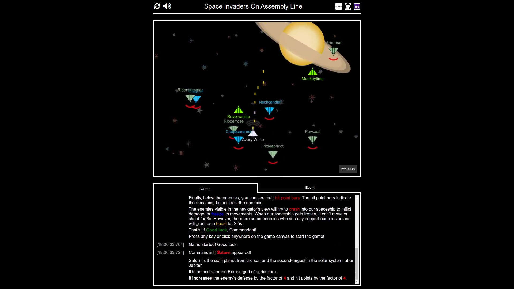

[](https://github.com/sarumaj/edu-space-invaders/actions/workflows/deploy.yml)
[](https://goreportcard.com/report/github.com/sarumaj/edu-space-invaders)
[](https://codeclimate.com/github/sarumaj/edu-space-invaders/maintainability)
[](https://pkg.go.dev/github.com/sarumaj/edu-space-invaders)
[](https://go.dev)

---

# space-invaders

this is an example project to showcase the game development using the Web Assembly Framework in Go.
Web Assembly allows us to develop web-frontend applications in a runtime like Go.

<a href="https://youtu.be/t-5W3WgnDkI">
  <p align="center">
    
  </p>
</a>

Click here to play the game:

<a href="https://space-invaders.sarumaj.com">
  <p align="center">
    
  </p>
</a>

## Setup

To setup similar project follow following steps:

1. Create GitHub repository.
2. [Install](https://github.com/git-guides/install-git) git CLI and [authenticate](https://docs.github.com/en/authentication/keeping-your-account-and-data-secure/about-authentication-to-github) it.
3. Clone your repository:
   ```
   git clone https://github.com/[username]/[repository name]
   cd [repository name]
   ```
4. Initialize new Go module: `go mod init github.com/[username]/[repository name]`, where `github.com/[username]/[repository name]` will be your module name.
5. Start coding. Additional libraries can ben added using `go get [module name]`. Use `go mod tidy` if necessary.
6. Define unit tests and execute: `go test -v ./...`
7. Generate Assembly files and goodies for the distribution package: `go generate ./...`
8. Execute: `go run [program entrypoint file]`
9. Build: `go build [program entrypoint file]`
10. Utilize version control:
11. Status check: `git status`
12. Pull: `git pull`
13. Stage and commit:
    ```
    git add .
    git commit -m "[your commit message goes here]"
    ```
14. Push: `git push`
15. Advanced usage:
    1. Create a temporary branch: `git checkout -b [branch name]`
    2. Pull, stage, commit
    3. Push: `git push --set-upstream origin [branch name]`
    4. Create pull request and merge it through the web interface ([github.com](github.com))

## Application structure

- [directory cmd](cmd)
  - [directory space-invaders](cmd/space-invaders)
    - [game server endpoint definitions handlers.go](cmd/space-invaders/handlers.go)
    - [game server main.go](cmd/space-invaders/main.go)
    - [game server middleware definitions middlewares.go](cmd/space-invaders/middlewares.go)
    - [database model definitions model.go](cmd/space-invaders/model.go)
    - [utility functions util.go](cmd/space-invaders/util.go)
- [module file go.mod](go.mod)
- [source directory](src)
  - [package pkg](src/pkg)
    - [package config](src/pkg/config)
      - [unit tests for config.go](src/pkg/config/config_test.go)
      - [code file config.go](src/pkg/config/config.go)
      - [game config file config.ini](src/pkg/config/config.ini)
      - [unit tests for envvariable.go](src/pkg/config/envvariable_test.go)
      - [code file envvariable.go](src/pkg/config/envvariable.go)
      - [code file js.go](src/pkg/config/js.go)
      - [code file os.go](src/pkg/config/os.go)
      - [unit tests for template.go](src/pkg/config/template_test.go)
      - [code file template.go](src/pkg/config/template.go)
    - [package handler](src/pkg/handler)
      - [code file contextaccess.go](src/pkg/handler/contextaccess.go)
      - [code file handler.go](src/pkg/handler/handler.go)
      - [code file handlerjs.go](src/pkg/handler/handlerjs.go)
      - [code file handleros.go](src/pkg/handler/handleros.go)
      - [code file keyevent.go](src/pkg/handler/keyevent.go)
      - [code file mouseevent.go](src/pkg/handler/mouseevent.go)
      - [code file touchevent.go](src/pkg/handler/touchevent.go)
    - [package numeric](src/pkg/numeric)
      - [code file arithmetic.go](src/pkg/numeric/arithmetic.go)
      - [unit tests for figure.go](src/pkg/numeric/figure_test.go)
      - [code file figure.go](src/pkg/numeric/figure.go)
      - [code file number.go](src/pkg/numeric/number.go)
      - [unit tests for position.go](src/pkg/numeric/position_test.go)
      - [code file position.go](src/pkg/numeric/position.go)
      - [code file size.go](src/pkg/numeric/size.go)
      - [unit tests for vertices.go](src/pkg/numeric/vertices_test.go)
      - [code file vertices.go](src/pkg/numeric/vertices.go)
    - [package objects](src/pkg/objects)
      - [package bullet](src/pkg/objects/bullet)
        - [code file bullet.go](src/pkg/objects/bullet.go)
        - [code file bullets.go](src/pkg/objects/bullets.go)
      - [package enemy](src/pkg/objects/enemy)
        - [code file enemies.go](src/pkg/objects/enemies.go)
        - [code file enemy.go](src/pkg/objects/enemy.go)
        - [code file level.go](src/pkg/objects/level.go)
        - [code file type.go](src/pkg/objects/type.go)
      - [package planet](src/pkg/objects/planet)
        - [code file planet.go](src/pkg/objects/planet/planet.go)
        - [code file type.go](src/pkg/objects/planet/type.go)
      - [package spaceship](src/pkg/objects/spaceship)
        - [code file directions.go](src/pkg/objects/directions.go)
        - [code file spaceship.go](src/pkg/objects/spaceship.go)
        - [code file level.go](src/pkg/objects/level.go)
        - [code file state.go](src/pkg/objects/state.go)
    - [directory static](src/static)
      - [static file favicon.ico](src/static/favicon.ico)
      - [static file index.html](src/static/index.html)
      - [static file style.css](src/static/style.css)
      - [static file wasm.js](src/static/wasm.js)
      - [directory audio](src/static/audio)
        - [audio file spaceship_acceleration.wav](src/static/audio/spaceship_acceleration.wav)
        - [audio file spaceship_boost.wav](src/static/audio/spaceship_boost.wav)
        - [audio file spaceship_cannon_fire.wav](src/static/audio/spaceship_cannon_fire.wav)
        - [audio file spaceship_crash.wav](src/static/audio/spaceship_crash.wav)
        - [audio file spaceship_deceleration.wav](src/static/audio/spaceship_deceleration.wav)
        - [audio file spaceship_freeze.wav](src/static/audio/spaceship_freeze.wav)
        - [audio file spaceship_whoosh.wav](src/static/audio/spaceship_whoosh.wav)
        - [audio file theme_heroic.wav](src/static/audio/theme_heroic.wav)
    - [build script build.sh](src/build.sh)
    - [script to authenticate jwt.sh](src/jwt.sh)
    - [game entrypoint main.go](src/main.go)

The script [build.sh](src/build.sh) is meant to compile the web assembly package (main.wasm) and create a distribution package [dist](dist).
To authenticate the WASM application towards the game server, the [jwt.sh](src/jwt.sh) can be used. The application will then be able to call protected endpoints of the game servers, like `POST /scores` which is used to publish a highscore record. The JWT based authentication scheme is meant to prevent the manipulation of the scoreboard from outside.

The [game server](cmd/space-invaders/main.go) serves the files from the distribution package using the web assembly. The files can be served in any other runtime than Go.
Some code components are meant to be compiled only for the JS WASM architecture (e.g. [js.go](src/pkg/config/js.go) and [handlerjs.go](src/pkg/handler/handlerjs.go)).

To be able to compile the code for other targets and to run tests against it, build tags has been leveraged and some mock-ups haven been defined (e.g. [os.go](src/pkg/config/os.go) and [handleros.go](src/pkg/handler/handleros.go)). The heart of the web application is the JavaScript script building the bridge between the WASM package: [wasm.js](src/static/wasm.js) and our static web page: [index.html](src/static/index.html).

The game engine uses the **Hyperplane separation theorem** to detect object collisions.

## Furter reading

- [WebAssembly](https://go.dev/wiki/WebAssembly)
- [Hyperplane Separation Theorem](https://en.wikipedia.org/wiki/Hyperplane_separation_theorem)
